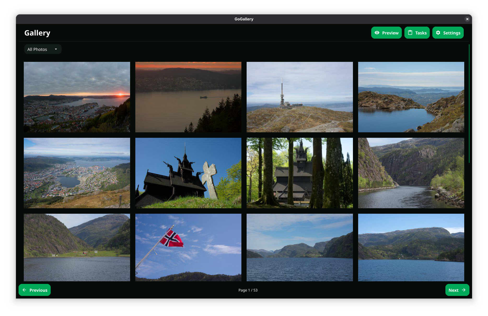
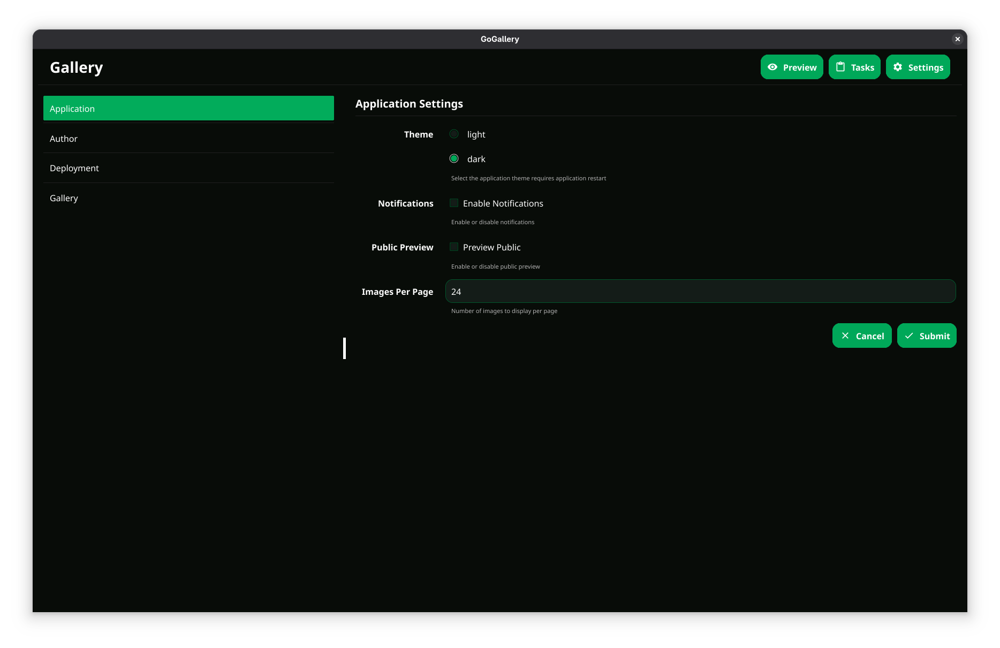
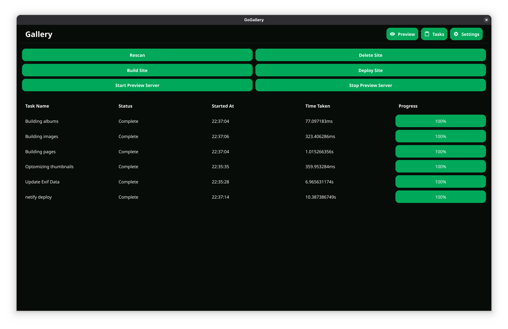
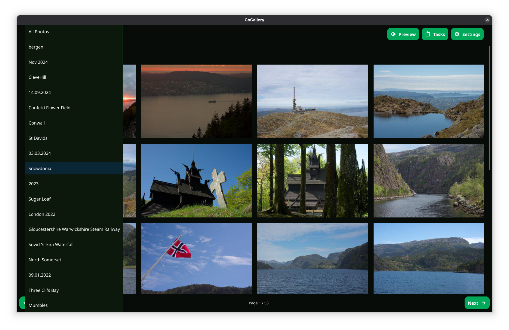
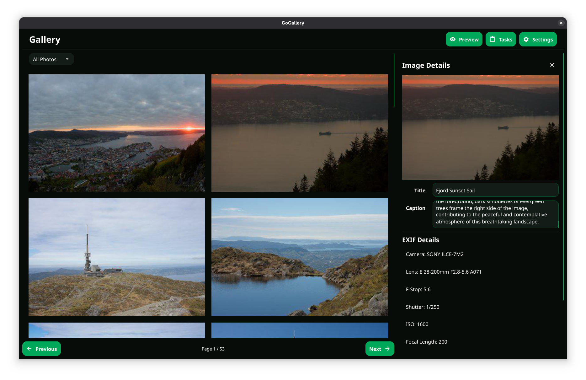
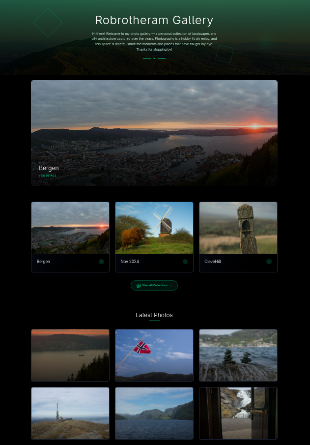
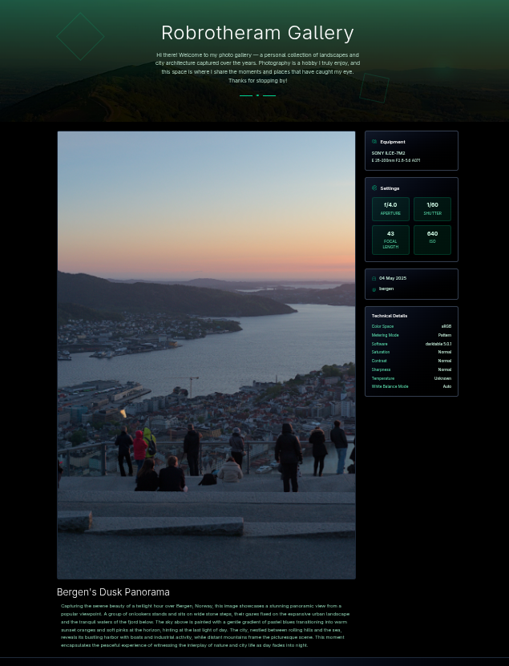
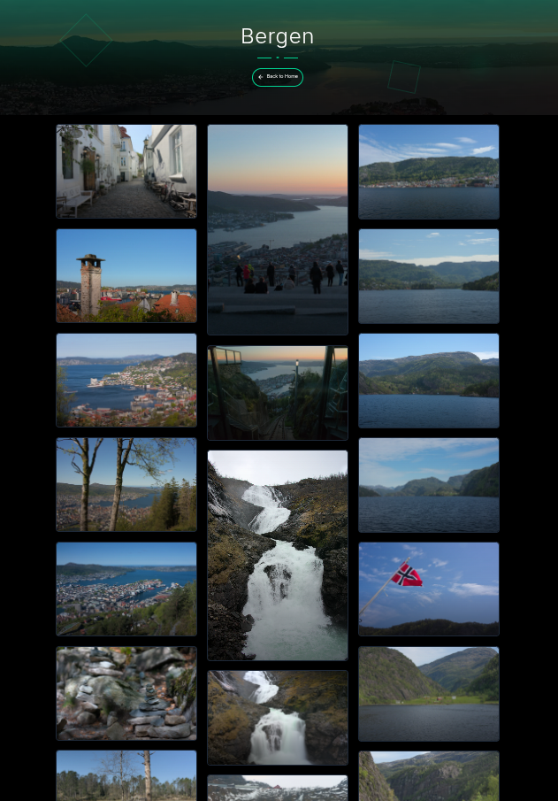

# GoGallery
***Its like Hugo but for large photo galleries***

GoGallery is a static site generator designed just for large photo sets. 
The problem is that just my modest approximate 1000 image gallery is around 5GB in size. This means traditional static stie generators where you host everything is github is not going to work. Also I do not want to keep reorgaising my photos or rely on some database. I have my photo in folders (albums) and I needed a tool to generate a webpage for those images.

Incomes GoGallery just point it at your photos and it will generate a static site for with a  customizable theme. The template language is Handlebars no fancy Javascript single page webapps here. What is included. is image optomization into multiple sizes for the web and the site also generates a PWA so it can act like a desktop/mobile app. Chrome Lighthouse scores the site at 93/100 for performance and 95/100 for accessibility

The Software also has a dashboard that you can use to manage the photos e.g change captions add albums to be hidden etc. You can also preview the site using the serve command 


## Usage

```
gogallery [flags]
```

### Options

```
      --config string   config file (default is $HOME/.gogallery.yaml)
  -h, --help            help for gogallery
```

### SEE ALSO

* [gogallery build](docs/cli/gogallery_build.md)	 - build static site
* [gogallery deploy](docs/cli/gogallery_deploy.md)	 - deploy static site
* [gogallery serve](docs/cli/gogallery_serve.md)	 - serve static site
* [gogallery template](docs/cli/gogallery_template.md)	 - extract template


---

## History

 The inspiration for this gallery is to provide a some of the functionaities of my old gallery cms Koken which has had no updates in over a year+ and had gone silent. *NOTE* that this is not a replacement for Koken just the very limited features I was using. 

The application uses react frontend and a seperate react dashboard that supports upload and managing photos in collections. 


## Demo


Demo at https://gallery.exceptionerror.io 

## Screenshots

### Dashboard/App

| Dashboard Home | Settings | Tasks |
|----------------|----------|-------|
|  |  |  |

| Album View | Sidebar |
|------------|---------|
|  |  |

### Generated Website

| Website Home | Photo Page | Collection Page |
|--------------|------------|-----------------|
|  |  |  |


## Contributing
Pull requests are welcome. For major changes, please open an issue first to discuss what you would like to change.

Please make sure to update tests as appropriate.

## License
[apache-2.0](https://choosealicense.com/licenses/apache-2.0)


## Building GoGallery

You can build GoGallery from source using Go. Make sure you have Go 1.20 or newer installed.

### Standard Build (CLI and Web)

You can use the provided Makefile for building:

```bash
make build         # Build the GoGallery CLI/web binary
make build-themes  # Build all theme assets (npm install/build/clean in each theme)
make clean         # Remove built binaries
```
This will produce the `gogallery` binary in your current directory.

Or, to build manually:

```bash
go build -o gogallery main.go
```

### Building the Fyne Desktop App

You can use the Makefile to build the Fyne desktop app and install dependencies:

```bash
make fyne-cli           # Install the Fyne CLI tool
make fyne-deps-ubuntu   # Install Fyne dependencies (Ubuntu)
make fyne-deps-fedora   # Install Fyne dependencies (Fedora/RedHat)
make fyne-build         # Build the Fyne desktop app for your platform
```

- The `fyne-build` target will auto-detect your OS and build the appropriate package.
- You can also run `make all` to install Fyne CLI and build the desktop app in one step.

> For more details, see the [Fyne documentation](https://developer.fyne.io/started/packaging) and the GoGallery wiki.

## Theme Development

See the [Theme Development Guide](themes/DEVELOPER_README.md) for instructions on building and customizing GoGallery templates and themes.
