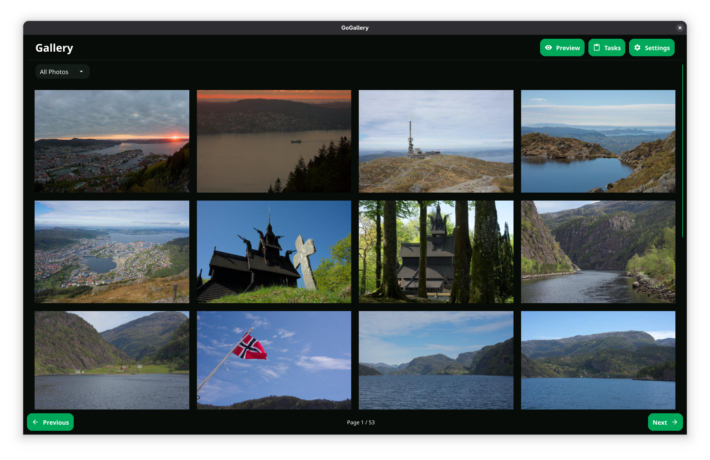
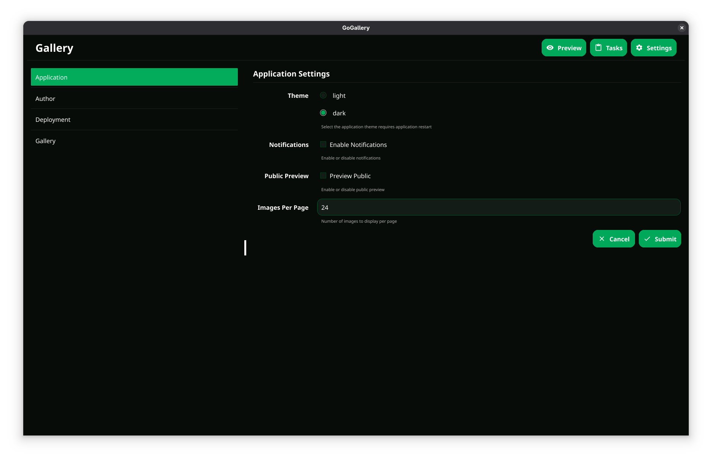
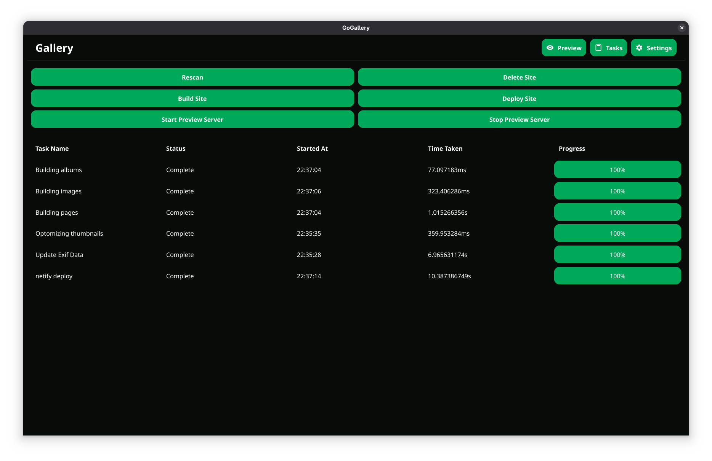
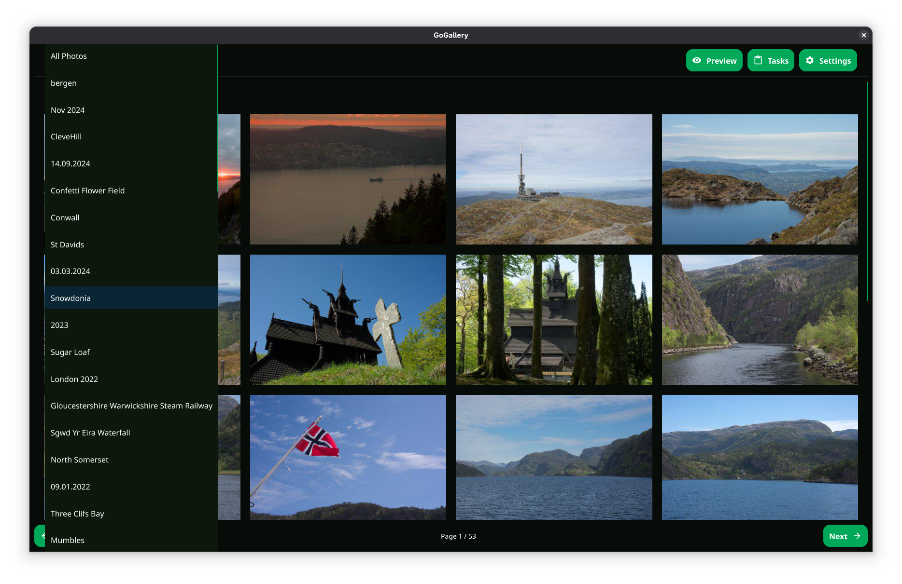
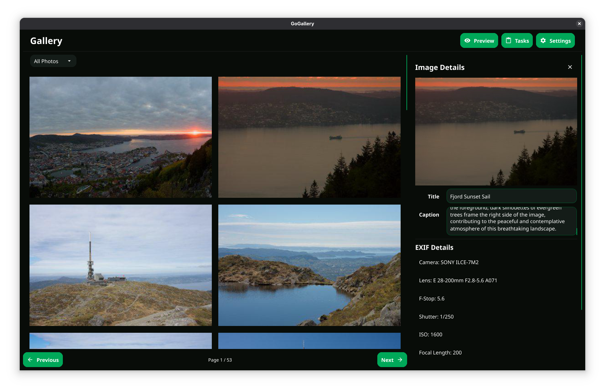
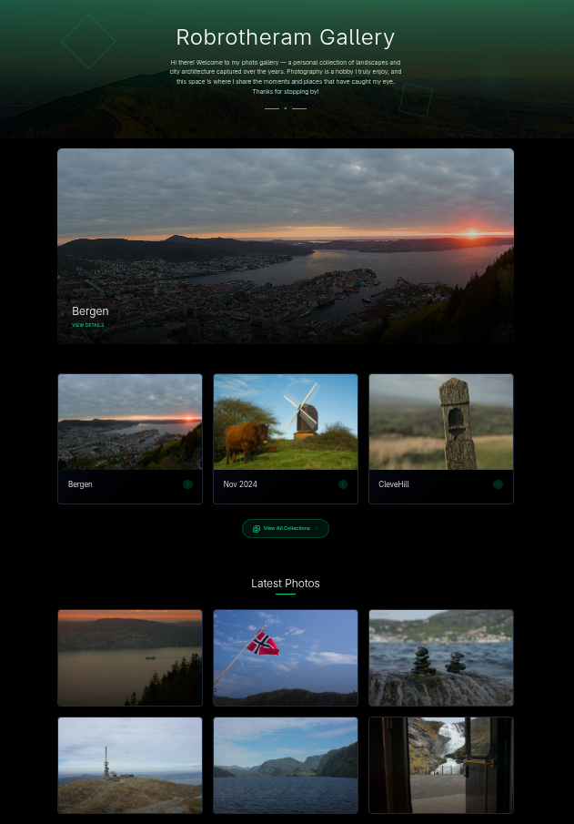
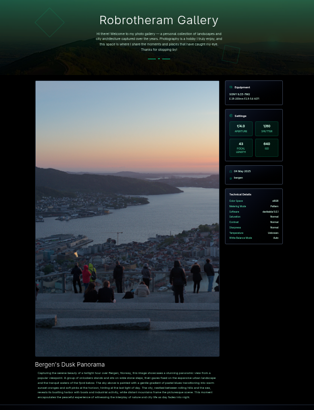
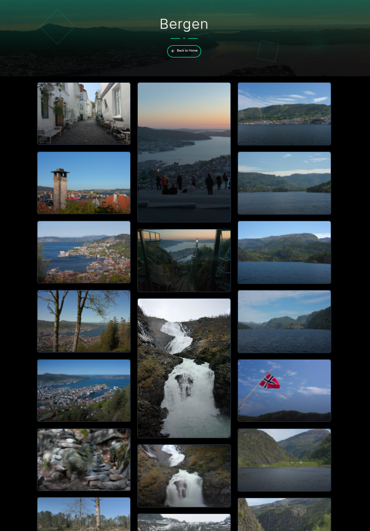

# GoGallery
***It's like Hugo, but for large photo galleries.***

GoGallery is a static site generator designed for large photo collections. A gallery of approximately 1,000 original images can easily reach 5 GB, making workflows that keep every asset in a Git repository impractical. GoGallery works with photos already organised in folders (albums), without requiring you to rearrange them around a separate content database.

Point GoGallery at your photos and it generates a static site with a customisable Go-template theme. It optimises images into multiple web-friendly sizes and generates a progressive web app that can be installed on desktop and mobile devices. The Fyne dashboard lets you edit titles, descriptions, tags, albums, and AI-generated photo metadata, as well as preview, build, and deploy the site.

The desktop dashboard lets you manage photo metadata, choose album covers, and control which albums and pictures are published. You can also preview the generated site with the `serve` command.


## Usage

```
gogallery [flags]
```

### Options

```
      --config string   config file (default is $HOME/.gogallery.yaml)
  -h, --help            help for gogallery
```

### SEE ALSO

* [gogallery build](docs/cli/gogallery_build.md)	 - build static site
* [gogallery deploy](docs/cli/gogallery_deploy.md)	 - deploy static site
* [gogallery serve](docs/cli/gogallery_serve.md)	 - serve static site
* [gogallery template](docs/cli/gogallery_template.md)	 - extract template


---

## History

GoGallery was inspired by the parts of the Koken gallery CMS that I used most. It is not intended to be a full Koken replacement.

The application provides a cross-platform Fyne dashboard for managing photos and collections alongside its command-line tools.


## Demo


Demo: https://gallery.exceptionerror.io

## Screenshots

### Dashboard/App

| Dashboard Home | Settings | Tasks |
|----------------|----------|-------|
|  |  |  |

| Album View | Sidebar |
|------------|---------|
|  |  |

### Generated Website

| Website Home | Photo Page | Collection Page |
|--------------|------------|-----------------|
|  |  |  |


## Contributing

Pull requests are welcome. For major changes, please open an issue first to discuss what you would like to change.

Please make sure to update tests as appropriate.

## License

[apache-2.0](https://choosealicense.com/licenses/apache-2.0)


## Building GoGallery

You can build GoGallery from source using Go. Make sure you have Go 1.26 or newer installed.

### Standard Build (CLI and Web)

You can use the provided Makefile for building:

```bash
make build         # Build the GoGallery CLI/web binary
make build-themes  # Build all theme assets (npm install/build/clean in each theme)
make clean         # Remove built binaries
```
This will produce the `gogallery` binary in your current directory.

Or, to build manually:

```bash
go build -o gogallery main.go
```

### Building the Fyne Desktop App

You can use the Makefile to build the Fyne desktop app and install dependencies:

```bash
make fyne-cli           # Install the Fyne CLI tool
make fyne-deps-ubuntu   # Install Fyne dependencies (Ubuntu)
make fyne-deps-fedora   # Install Fyne dependencies (Fedora/RedHat)
make fyne-build         # Build the Fyne desktop app for your platform
```

- The `fyne-build` target will auto-detect your OS and build the appropriate package.
- You can also run `make all` to install Fyne CLI and build the desktop app in one step.

> For more details, see the [Fyne packaging documentation](https://docs.fyne.io/started/packaging/) and the GoGallery wiki.

## Theme Development

See the [Theme Development Guide](themes/DEVELOPER_README.md) for instructions on building and customizing GoGallery templates and themes.
